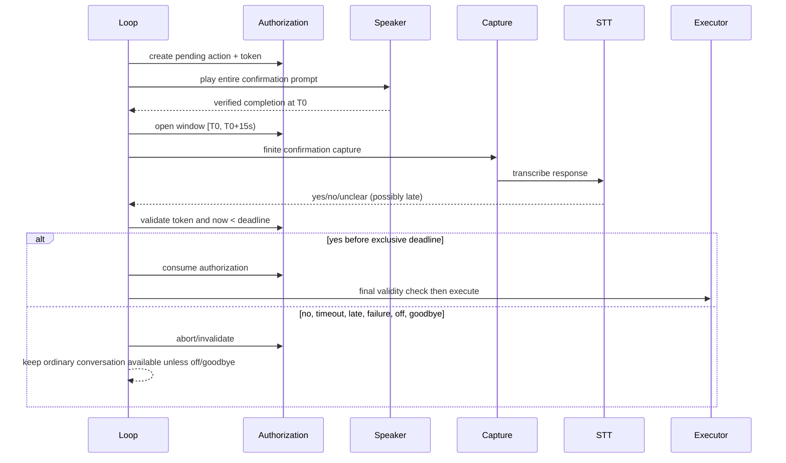

# Design: cancellable speech onset and fail-closed confirmation

## Decision summary

Implement slice 1 as two explicit policies behind the existing capture and confirmation seams:

1. **Ordinary capture** waits for speech onset without an elapsed onset deadline, but retains at most a bounded pre-roll. Once onset is detected, the existing finite trailing-silence and maximum-utterance rules apply.
2. **Dangerous confirmation** owns a non-renewable authorization record. Its deadline is created only from verified prompt completion, uses an exclusive boundary (`now >= deadline` is expired), and is checked after capture/classification and immediately before execution.

The loop remains the owner of lifecycle cancellation and execution ordering. Capture owns frame collection. Confirmation owns authorization validity. Playback remains non-overlapping: slice 1 must not enable barge-in or redesign `PiperSpeaker`/`Playback`.

This directly addresses PC-V04 and PC-S01, preserves PC-V03/PC-V05 safe listening, and leaves explicit seams for PC-L02 persistent conversation and PC-V06 hardware-gated interruption. It does not make slices 2 or 3 part of this implementation.

## Existing evidence and constraints

Observed code supports narrow changes rather than a backend rewrite:

- `jarvis/src/jarvis/audio/capture.py:gather_utterance` currently counts initial silence toward duration, ends on `None`, and already polls `stop_requested`.
- `jarvis/src/jarvis/audio/pipeline.py:UtteranceCapture.capture` calls `gather_utterance`, writes a temporary WAV, transcribes, and retains the last audio for speaker verification.
- `jarvis/src/jarvis/orchestrator/confirm.py:confirm` currently speaks, calls an unverified `flush()`, starts its clock deadline, and can classify a late affirmative before checking expiry.
- `jarvis/src/jarvis/orchestrator/loop.py` retries confirmation after `CaptureError`, currently allowing a new `confirm()` call to renew the deadline; off is applied at the start of `_tick` through `_apply_switch`.
- `jarvis/src/jarvis/orchestrator/contracts.py` exposes `Clock`, `Capture`, `Speaker`, and `CaptureError`; `state.py` has `CONFIRMING`, `EXECUTING`, `OFF`, and `STOPPED` but no slice-1 authorization object.
- `config.py` wires `AUDIO_MAX_UTTERANCE_S = 120.0`, `AUDIO_SILENCE_MS = 800`, `AUDIO_BLOCK_MS = 100`, and `CONVERSATION_WINDOW_S = 8.0`. The latter remains a later persistent-conversation concern; it is not repurposed here.

Review budget: keep the design and eventual implementation narrow (target files are the five areas named above plus focused unit tests), below the 800-line session budget. Do not change providers, retention, speaker enrollment, audio routing, or the general playback backend.

## Architecture and ownership

| Component | Slice-1 responsibility | Explicitly not responsible for |
|---|---|---|
| `capture.py` | Classify pre-onset, collecting, cancelled, no-frame, and device-failure outcomes; bound idle frames; enforce post-onset cap/end silence. | STT, authorization, wake policy, or persistent history. |
| `UtteranceCapture` | Adapt capture outcome to transcript/STT; pass mode and cancellation through; never transcribe an empty/cancelled capture. | Deciding whether an action is safe. |
| `confirm.py` | Create and consume one authorization lifecycle; require completion evidence; classify only while valid; fail closed. | Executing actions or deciding conversation closure. |
| `loop.py` | Supply cancellation, establish prompt/mic readiness, invalidate work on off/control, and check validity before entering `EXECUTING`. | Owning frame buffering or extending deadlines. |
| `contracts.py` | Define small protocols/data types used by fakes and adapters. | Concrete device or TTS behavior. |
| `state.py` | Preserve current state transitions; optionally add explicit cancellation/invalidation events only where needed for observability. | Implementing a second conversation FSM in this slice. |

### Concurrency rule

The loop is the single owner of a capture/confirmation operation token. Every operation receives a monotonically increasing generation (or opaque cancellation token) and a cancellation predicate. Off, shutdown, goodbye, and a newer operation invalidate the token. A worker may finish normally, but its result is accepted only if its token is still current and the switch is on. No worker may start capture, playback, or execution after invalidation.

The capture reader is synchronously consumed by the owner; no new capture thread is required. Device callbacks may continue filling the existing queue, but `stop()` and the cancellation predicate must make the owner return promptly. `SoundDeviceCapturer.read_frames(None)` is not treated as a completed utterance: it is a poll/no-frame result. A distinct device exception/status is surfaced as `CaptureError` (or a narrow capture-device error translated to it), never converted into silence.

Authorization is immutable from the caller's perspective. The confirmation owner may transition a record only once to `VALIDATED`, `ABORTED`, `EXPIRED`, or `INVALIDATED`; retries cannot recreate it. Execution receives the record/action identity and must reject an invalid or expired record before dispatch.

## Interfaces and contracts

Names below are proposed contracts for implementation, not claims that they already exist.

```python
class CaptureMode(Enum):
    ORDINARY = "ordinary"       # unlimited onset wait, bounded idle retention
    CONFIRMATION = "confirmation"  # finite caller-controlled deadline

class CaptureStatus(Enum):
    UTTERANCE = "utterance"
    CANCELLED = "cancelled"
    DEVICE_FAILURE = "device_failure"

@dataclass(frozen=True)
class CaptureResult:
    status: CaptureStatus
    blocks: tuple[np.ndarray, ...]
    duration_s: float
    onset_seen: bool
    no_frame_polls: int = 0

class Cancellation(Protocol):
    def cancelled(self) -> bool: ...

class PromptCompletion(Protocol):
    def completed(self) -> bool: ...
```

The concrete API may use existing duck-typed fakes, but its semantics must be equivalent:

- `gather_utterance(..., mode=CaptureMode.ORDINARY, idle_preroll_blocks=N, deadline=None, stop_requested=...)` waits for onset in ordinary mode and applies `deadline` only to finite callers.
- `CaptureResult` distinguishes cancellation and device failure from no speech. A no-frame poll is retryable and does not end ordinary waiting; repeated no-frame polls must still check cancellation and may be bounded by a device-health policy.
- `UtteranceCapture.capture(mode=..., deadline=..., operation=...)` returns `None` only for ordinary silence/no utterance where the caller policy permits it. Cancelled capture returns no dispatchable transcript. STT errors remain `CaptureError`.
- Confirmation takes a prompt completion capability/result, a shared operation token, and the injected `Clock`. `confirm()` must not infer completion from `speaker.speak()`, `flush()`, queue emptiness, elapsed sleep, or `is_playing() == False` unless the speaker contract explicitly reports verified completion for that prompt.
- The existing `Speaker` protocol remains source-compatible. The narrow seam is an optional `speak_and_wait(prompt, token) -> PromptCompletion` adapter or an equivalent loop-owned completion callback. If verified completion cannot be obtained, confirmation aborts rather than authorizes.

`Clock.now()` is the logical deadline clock. A real monotonic safety guard may remain as a secondary escape hatch for a blocked adapter, but it cannot start authorization and cannot replace the injected-clock validity checks.

## Capture lifecycle

```text
STANDBY/ACTIVE
    |
    | start ordinary capture, token valid
    v
WAITING_FOR_ONSET -- cancel/off/shutdown --> CANCELLED
    |                 |
    | no-frame poll   +--> no retained transcript
    | speech detected
    v
COLLECTING_POST_ONSET -- cancel/off --> CANCELLED
    | trailing silence OR max utterance
    v
UTTERANCE_READY --> STT --> TRANSCRIPT_READY
    |
    +--> device failure --> DEVICE_FAILURE/CaptureError
```

Pre-onset blocks are handled by a bounded deque. The implementation must choose the configured bound in blocks (derived from a finite `AUDIO_PREROLL_S`, defaulting to a small value such as the existing wake pre-roll only if product/config review confirms it); it must not silently reuse the 120-second utterance cap. When the deque is full, the oldest idle block is discarded. Onset keeps only that bounded pre-roll plus subsequent blocks. No idle-only WAV is written and no idle audio is persisted.

After onset, `duration_s` starts at onset, not at the first poll. The existing `AUDIO_SILENCE_MS` trailing endpoint and `AUDIO_MAX_UTTERANCE_S` cap remain finite and configurable. Empty blocks are not speech. A transient `None` from the queue causes another poll, not completion; a device error stops the operation and reports failure. Cancellation is checked before and after reads, before WAV creation, and before returning a transcript.

Confirmation capture is never allowed to inherit ordinary indefinite onset behavior. It uses a finite response deadline and a cancellation-aware reader. If the deadline expires while a read/STT operation is blocked, the adapter must return a late/expired result or error that the confirmation owner maps to fail-closed; it must not wait forever for ordinary onset.

## Confirmation lifecycle and boundary rules

```text
DANGEROUS_INTENT
    |
    | create Authorization(id, action, token, state=PENDING)
    v
PROMPTING -- failure/cancel/off/goodbye/no completion --> INVALIDATED
    |
    | verified prompt completion at T0
    v
AWAITING_RESPONSE [deadline = T0 + 15s]
    | no / unclear                 | now >= deadline
    v                             v
ABORTED                       EXPIRED
    |
    | affirmative result
    | validate token + now < deadline
    v
VALIDATED -- token invalid/off/goodbye/now >= deadline --> REJECTED
    |
    | final check immediately before executor dispatch
    v
EXECUTING (authorization consumed; no renewal)
```

The exact boundary is exclusive: `now == deadline` is expired. The owner checks validity in three places: before accepting a classified affirmative, before returning `CONFIRMED` to the loop, and immediately before execution. Capture start time, speech onset time, and a timely-looking STT result do not override completion time or the final check.

A capture/STT error does not call `confirm()` again for the same intent. It may report a recoverable error while the same record remains subject to its original deadline only if the record is still valid and the design explicitly permits another read; it must never replay the prompt or move `deadline`. If prompt completion was not verified, or readiness cannot be established, the record is invalidated. A fresh dangerous request is required for a new authorization lifecycle.

Explicit goodbye is a later interpreter/control integration seam, but the invalidation contract is slice-1-ready: a control event calls `authorization.invalidate(reason="goodbye")` before any late result can be accepted. GUI off has stronger precedence and calls the same invalidation plus capture cancellation and mic release. This slice does not add the goodbye parser or persistent active-conversation behavior.

## Voice-flow sequence diagrams

### Ordinary wake to action

```mermaid
sequenceDiagram
    participant U as User
    participant W as WakeDetector
    participant C as Capture
    participant S as STT
    participant I as Interpreter
    participant L as Loop
    participant E as Executor

    U->>W: wake name
    W-->>L: activation + bounded wake pre-roll
    L->>C: capture(ORDINARY, token)
    Note over C: wait indefinitely for onset; retain bounded idle pre-roll
    U->>C: speech onset and finite utterance
    C-->>L: utterance-ready
    L->>S: transcribe finite post-onset audio
    S-->>L: transcript
    L->>I: resolve transcript
    I-->>L: allowlisted interpretation
    L->>E: execute only if non-dangerous gates pass
    E-->>L: ActionResult
```

For a dangerous interpretation, the last leg is replaced by the confirmation sequence. Capture cancellation or device failure terminates the operation without interpreter dispatch or execution.

### Dangerous confirmation



## Configuration

Add only narrowly scoped, finite settings, with defaults preserving current behavior where possible:

- `AUDIO_PREROLL_S`: maximum ordinary pre-onset retention; bounded independently from `AUDIO_MAX_UTTERANCE_S`.
- `AUDIO_READ_POLL_S` (or reuse the existing read timeout): queue poll interval used to observe cancellation without busy looping.
- `CONFIRM_TIMEOUT_S = 15.0`: retain the existing public constant; do not allow ordinary capture settings to override it.
- Optional device no-frame health bound is a failure-detection policy, not an onset timeout. It must be documented and tested so a dead device is not mistaken for indefinite silence.

Do not change `CONVERSATION_WINDOW_S` into an indefinite session setting in this slice. Do not add retention, provider, wake threshold, AEC, or interruption configuration.

## Error and observability contract

Log structured, non-transcript metadata for `capture_started`, `speech_onset`, `capture_cancelled`, `capture_device_failure`, `capture_completed`, `prompt_completion_verified`, `confirmation_expired`, `confirmation_invalidated`, `confirmation_late_result`, and `authorization_consumed`. Include operation id, state, reason, and monotonic timestamps; never log retained idle audio or affirmative content unnecessarily.

User-visible behavior remains conservative: STT/device failure uses the existing `STT_ERROR_SPOKEN`; timeout uses `CONFIRM_TIMEOUT_SPOKEN`; refusal uses `CONFIRM_CANCEL_SPOKEN`. No error path says an action ran unless the executor returned success. Metrics should distinguish no-frame polls from silence and cancellation so an indefinitely waiting microphone is diagnosable.

## Test strategy (strict TDD later)

Implementation must follow RED, GREEN, TRIANGULATE, REFACTOR; this design phase runs no tests.

Focused tests should cover:

- `tests/unit/test_audio_capture.py`: long pre-onset silence followed by speech; onset-relative duration; bounded pre-roll; repeated `None`; cancellation during wait and collection; device failure; post-onset trailing silence/max cap.
- `tests/unit/test_audio_pipeline.py`: cancelled/empty capture does not write or transcribe; finite confirmation mode is not replaced by ordinary mode; STT receives only finite utterance audio.
- `tests/unit/test_confirm.py`: prompt completion starts T0; enqueue/unverified flush cannot start it; exact `T0+15` rejection; late STT and late execution rejection; prompt failure; off/goodbye/cancellation invalidation; retry does not renew; valid yes consumes once.
- `tests/unit/test_loop.py` and `test_switch_signal.py`: off cancels pending capture/authorization and late results do not dispatch; existing wake-gated/non-overlap behavior remains intact.

Use fake clocks, capturers, prompt-completion outcomes, and executor gates to force races deterministically. Add no hardware claim to unit evidence; PC-V06 remains disabled and requires later manual evidence on both target devices.

## Rollout, rollback, and integration seams

Roll out behind the ordinary-capture mode selection while retaining a finite legacy mode for immediate rollback. First enable the new capture policy for ordinary post-activation capture only; confirmation always uses its finite policy. Monitor cancellation, device-failure, no-frame, and late-confirmation counters before widening use.

Rollback means selecting finite/wake-gated capture and disabling the new onset policy, while retaining the fail-closed confirmation lifecycle. Never restore accepting late affirmatives or renewing confirmation on retries. Off must continue to stop the capturer, invalidate tokens, stop output, and prevent late work from reactivating processing.

The operation token, capture mode, verified prompt completion, and authorization record are the seams later slices consume. Slice 2 can replace the current `CONVERSATION_WINDOW_S`/`IDLE` expiry with an active conversation lifecycle and add deterministic goodbye control without changing capture safety. Slice 3 can attach output-generation cancellation and hardware-gated interruption to the same token boundary; until then, playback stops the microphone during TTS and captured TTS audio remains discarded. No slice-1 design decision claims echo cancellation or preserved overlapping speech.

## Non-goals and acceptance checklist

Not included: persistent conversation state or goodbye parsing; barge-in; AEC/audio routing; queued/in-flight TTS cancellation; provider or retention changes; history redesign; speaker enrollment; new commands; general backend rewrite; hardware validation; implementation, tests, shell commands, or commits in this phase.

Reviewers should be able to verify that:

- ordinary idle waiting is cancellable and bounded in retained audio;
- post-onset utterances remain finite;
- no-frame and device failure have different outcomes;
- confirmation starts only after verified prompt completion;
- equality and all late-result paths fail closed;
- retries cannot renew authorization;
- off/cancellation/goodbye invalidation wins races;
- existing non-overlap and PC-V06 hardware gate remain intact.
