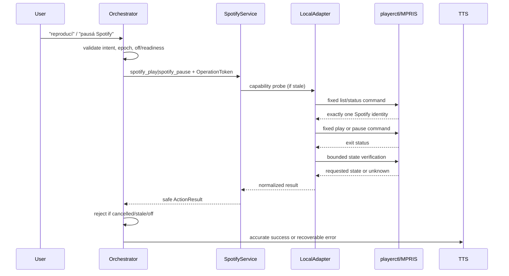
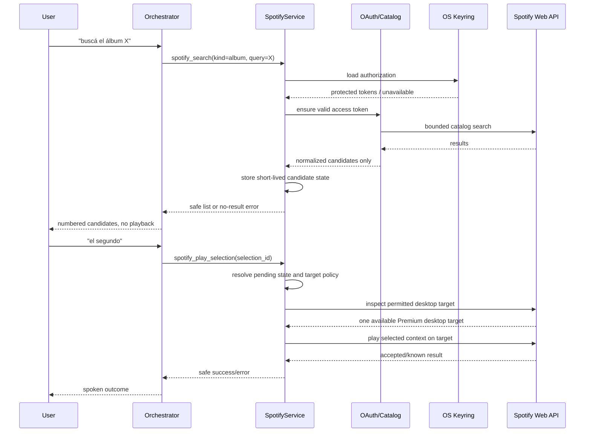

# Technical Design: Spotify Desktop Control

## SDD Result Contract

- **phase:** design
- **change:** `jarvis-spotify-control`
- **status:** completed
- **artifact:** `openspec/changes/jarvis-spotify-control/design.md`
- **skill_resolution:** fallback-path
- **artifact_store:** openspec
- **next_phase:** tasks
- **code_changed:** none
- **out_of_scope_artifacts:** tasks and implementation

## 1. Design summary and decisions

This design adds one Spotify domain boundary with two explicitly separated implementations:

- **Stage 1:** local, credential-free Spotify Desktop control through a Spotify-targeted MPRIS/playerctl adapter.
- **Stage 2:** opt-in Spotify Web API catalog and playback integration using OAuth Authorization Code with PKCE.

The existing `open_app` path remains authoritative for opening Spotify. Neither stage adds `playerctl` to `execute`, expands the application allowlist, or accepts command strings from voice input.

Key decisions:

1. **Dedicated intents:** use narrow validated intents such as `spotify_play`, `spotify_pause`, `spotify_search`, and `spotify_play_selection`; backend verbs, shell arguments, tokens, and device IDs are never interpreter entities.
2. **One domain service, separate capabilities:** `SpotifyService` selects only the capability requested by the intent. Stage 1 cannot call the network; Stage 2 cannot silently fall back to another player or local arbitrary control.
3. **Fail closed on identity:** local control requires exactly one MPRIS player whose identity is Spotify. API playback requires one configured/verified Spotify Desktop target and does not transfer or switch devices.
4. **OS keyring is required for OAuth secrets:** no plaintext token-file fallback. If protected storage is unavailable, OAuth remains unavailable and Stage 1 continues to work.
5. **Clarification is state, not LLM choice:** ambiguous catalog results create a bounded pending-selection state containing opaque Spotify IDs and safe display labels. Playback requires a subsequent validated selection or an unambiguous result.
6. **Cancellation is authoritative at the domain boundary:** adapters receive the operation token and check it before side effects and before returning a success result. The orchestrator also rejects stale results.

## 2. Data and control boundaries

```text
Voice/STT transcript
        |
        v
Interpreter + schema validation
  (intent + constrained entities only)
        |
        v
Orchestrator lifecycle gate
  (off, epoch, OperationToken, readiness)
        |
        v
Spotify registry handler
        |
        v
SpotifyService / capability policy
   |                         |
   v                         v
Stage 1 LocalAdapter       Stage 2 OAuthApiAdapter
(playerctl/MPRIS)          (HTTPS Spotify Web API)
   |                         |
   v                         v
Spotify Desktop local       Keyring + OAuth state
MPRIS player                + catalog/device APIs
```

### Boundary rules

- The interpreter may emit only fixed action names and validated search/type/selection fields. It cannot emit `playerctl`, URLs, OAuth codes, token values, arbitrary URIs, device IDs, or subprocess arguments.
- The registry handler receives `Intent` plus `Session`; it obtains the operation token/context through the existing execution seam or a small injected Spotify operation context. It never receives raw transcripts.
- The local adapter owns subprocess mechanics and uses fixed list arguments. The API adapter owns HTTP, PKCE, token refresh, response normalization, and redaction.
- Normalized domain results contain a public status/error code and safe metadata only. Raw stderr, HTTP bodies, authorization URLs, access tokens, refresh tokens, and callback parameters do not cross into `ActionResult.spoken`, history, prompts, or diagnostics.
- `ActionResult.data` may contain only safe, non-secret selection/status metadata; it is not persisted as an opaque provider response.

## 3. Domain contracts

### 3.1 Validated intents

The schema/domain allowlist should add only the following conceptual actions:

| Intent | Allowed entities | Semantics |
|---|---|---|
| `spotify_play` | none | Play loaded local Spotify content (Stage 1). |
| `spotify_pause` | none | Pause local Spotify content (Stage 1). |
| `spotify_search` | `kind` (`album` or `artist`), `query` (bounded text) | Stage 2 official catalog search; never plays. |
| `spotify_play_selection` | `selection_id` (opaque, short-lived), optional `kind` | Play only a previously presented clarified result. |
| `spotify_auth` / `spotify_revoke` | none | Explicit integration enable/revoke lifecycle, exposed only through an approved non-ambiguous configuration path. |

Exact naming may follow repository conventions, but the properties are mandatory: no generic `execute`, no caller-provided command, no free-form URI, and no user-provided device selector routed directly to a backend.

Spanish deterministic patterns should cover play/pause and explicit search verbs. LLM classification may handle ordinary wording only after schema validation; unsupported playlists, recommendations, arbitrary tracks, other players, and account mutations remain rejected.

### 3.2 Adapter interfaces

Conceptual interfaces (not implementation code):

- `LocalSpotifyAdapter.capabilities() -> CapabilityReport`
- `LocalSpotifyAdapter.play(operation) -> LocalResult`
- `LocalSpotifyAdapter.pause(operation) -> LocalResult`
- `CatalogClient.search(kind, query, operation) -> SearchResult`
- `PlaybackClient.play(context, target, operation) -> PlaybackResult`
- `CredentialStore.load/save/delete() -> CredentialState`
- `OAuthClient.authorize/revoke/refresh() -> AuthorizationState`
- `SpotifyService.dispatch(validated_intent, operation_context) -> DomainResult`

Every adapter method has a bounded deadline and accepts cancellation. Results use stable categories (`ok`, `capability_unavailable`, `not_authorized`, `premium_required`, `ambiguous`, `not_found`, `target_unavailable`, `timeout`, `cancelled`, `provider_error`, `invalid_request`) plus safe user-facing text selected by the service.

## 4. Stage 1 design: independently implementable local adapter

### 4.1 Capability detection and identity

At startup or first request, the local adapter performs a side-effect-free capability probe:

1. Verify the configured executable (`playerctl` by default) is present and executable.
2. Query player names/instances using fixed arguments equivalent to `playerctl -l`, with no shell.
3. Filter only an exact Spotify identity (case-normalized accepted MPRIS identity is configured, default `spotify`).
4. Require exactly one matching player. Zero matches means unavailable; multiple matches means ambiguous and fails closed.
5. Optionally query metadata/status with a separate fixed call and verify the returned identity still belongs to Spotify before control.

The adapter never uses `--player=%any`, “current player”, or an active-player fallback. It does not control another MPRIS player if Spotify is absent.

### 4.2 Fixed commands, arguments, and timeouts

The command table is internal and immutable:

| Operation | Fixed argv shape | Default timeout |
|---|---|---:|
| list capability | `playerctl -l` | 1.0 s |
| verify status | `playerctl --player=spotify status` | 1.5 s |
| play | `playerctl --player=spotify play` | 2.0 s |
| pause | `playerctl --player=spotify pause` | 2.0 s |

The configured player name may replace the fixed identity token only after strict validation against a small identifier grammar; it is not derived from user text. The subprocess uses `shell=False`, captured output, a process-group/timeout policy, and redacted diagnostics. No metadata or stderr is spoken verbatim.

Success requires a zero exit code and, where supported, a post-command status verification that matches the requested state. A command that returns success but cannot establish the requested state is reported as `state_unknown`, never as success.

### 4.3 Stage 1 flow



If Spotify is not running, this operation does not implicitly launch it. The user may use the existing allowlisted `open_app` command and retry. This keeps opening semantics unchanged and makes Stage 1 independently deployable without OAuth, HTTP, credentials, or Stage 2 configuration.

### 4.4 Stage 1 lifecycle and diagnostics

The registry marks local calls bounded and non-destructive. The handler checks cancellation before probing, before control, and before returning. The subprocess timeout is treated as failure; a late result cannot produce speech or a control side effect after invalidation. `off`, goodbye, replacement epochs, and unavailable TTS/microphone readiness follow existing loop behavior.

Diagnostics expose safe facts only: adapter enabled, executable found, D-Bus/MPRIS query result, matching-player count, last capability timestamp, timeout, and normalized error category. They never include raw command output, transcript secrets, or arbitrary arguments. A capability diagnostic may say “Spotify local control unavailable: no unique Spotify player” but not leak host internals.

## 5. Stage 2 design: OAuth PKCE, catalog clarification, and safe playback

### 5.1 Opt-in and OAuth boundary

Stage 2 is disabled by default. Explicit enablement requires a configuration command or documented local setup action, followed by the official Spotify Authorization Code with PKCE flow. Existing destructive confirmation is not used as a substitute for account consent.

- Client ID is non-secret configuration and may be supplied through environment/configuration; no client secret is required for the public PKCE client.
- Generate a cryptographically random verifier and state; persist only the short-lived authorization transaction, with state bound to the local process/session.
- Use a loopback redirect on a configured local address and a narrow callback lifetime. Validate returned state exactly, reject unsolicited callbacks, and clear the transaction after success/failure.
- Request only `user-read-playback-state` and `user-modify-playback-state`. Catalog search itself requires no account scope; these scopes are the minimum for device/readiness checks and playback control.
- Never place the authorization code, verifier, token, refresh token, or callback query in logs, history, prompts, spoken output, URLs shown to the user, or exception text.

### 5.2 Protected token storage and lifecycle

The credential store uses the desktop OS keyring under a stable Jarvis/Spotify service key. Stored values are access token, refresh token, expiry, scope set, and provider account/device-safe identifiers as needed. Storage access failures disable Stage 2 rather than writing plaintext files. File permissions alone are not an acceptable fallback for token material.

Access tokens are refreshed only shortly before expiry, under a single-flight lock to avoid refresh races. A refresh response replaces the stored token atomically. HTTP 401 or invalid-grant marks authorization invalid and requires reauthorization; it does not retry indefinitely. Revoke/disable deletes keyring material, clears pending selection and authorization transaction state, and prevents further API calls. Diagnostics report `authorized`, `expired`, `revoked`, `disabled`, or `storage_unavailable`, never token fragments.

### 5.3 Catalog search and candidate state

Search is limited to album or artist and uses the official `/v1/search` endpoint with bounded query length, fixed market behavior, and a bounded result count. Search terms may leave the machine only after Stage 2 is enabled and authorized as required by the selected flow; local-only Stage 1 never invokes this client.

Results are normalized to an opaque short-lived `selection_id`, kind, display name, artist/album summary, and safe URI/ID held in memory. The raw API response is discarded after normalization. Candidate state is session-bound, expires after a short TTL, is replaced by each new search, and is invalidated by off, cancellation, goodbye, revoke, or a new unrelated command.

- No results: speak a recoverable not-found response.
- Exactly one plausible result: present it and allow the service to retain a pending unambiguous selection; playback still requires the explicit playback request unless the utterance was an explicit “search and play” form that has been designed as a two-step confirmation-like clarification.
- Multiple plausible results: speak a numbered bounded list and ask which one. No ranking, fuzzy automatic choice, or playback occurs.
- Clarification accepts only a number or exact opaque selection reference resolved against the pending in-memory candidates; it does not pass arbitrary user text to Spotify playback.



### 5.4 Premium and desktop-target policy

Before playback, the service must establish all of the following:

1. Authorization is enabled, valid, and includes the approved scopes.
2. The account is Premium. A non-Premium response is a terminal `premium_required` error.
3. Spotify Desktop on this PC is the configured target and is currently available through the local identity/capability check plus the Web API device inventory.
4. Exactly one target matches the configured target fingerprint/policy. Device IDs are treated as volatile; a stored ID alone is insufficient after it disappears or changes.
5. The target is not another Connect device, mobile device, browser, or an ambiguous desktop instance.
6. The selected album/artist URI is from the current pending candidate state and is supported for the requested playback operation.

The service calls the playback endpoint with the selected context and the verified target device ID only when all checks pass. It does not call transfer-user-playback, select another device, retry on another device, open a URI through browser/UI automation, or fall back to MPRIS for a Stage 2 context request. If the result is accepted but playback state cannot be verified within the bounded follow-up, report `state_unknown` rather than success.

```mermaid
sequenceDiagram
    participant S as SpotifyService
    participant L as Local identity check
    participant W as Spotify Web API
    participant D as Spotify Desktop

    S->>L: verify unique local Spotify MPRIS
    L-->>S: local target identity / unavailable
    S->>W: GET /me/player (authorized)
    W-->>S: account/device state
    S->>S: require Premium + one matching desktop target
    alt checks fail
        S-->>S: no playback call; safe typed error
    else checks pass
        S->>W: PUT /me/player/play(device_id, context_uri)
        W-->>S: accepted
        S->>W: bounded state readback
        W-->>S: target/context state or unknown
        S-->>D: playback occurs only on verified target
    end
```

## 6. Configuration and rollout controls

Configuration is additive and validated at load time. Suggested keys are:

| Key | Default/policy | Purpose |
|---|---|---|
| `SPOTIFY_LOCAL_ENABLED` | true only when adapter is enabled | Stage 1 capability switch. |
| `SPOTIFY_PLAYERCTL_BIN` | `playerctl` | Executable path, validated as a trusted configured value. |
| `SPOTIFY_MPRIS_IDENTITY` | `spotify` | Exact local identity, never voice-controlled. |
| `SPOTIFY_LOCAL_TIMEOUT_S` | 2.0 | Maximum local operation timeout. |
| `SPOTIFY_API_ENABLED` | false | Explicit Stage 2 opt-in gate. |
| `SPOTIFY_CLIENT_ID` | unset | Public PKCE client ID; absence disables OAuth. |
| `SPOTIFY_REDIRECT_HOST/PORT` | loopback/configured | Narrow OAuth callback. |
| `SPOTIFY_API_TIMEOUT_S` | bounded, e.g. 5.0 | Connect/read deadline for API calls. |
| `SPOTIFY_TARGET_FINGERPRINT` | unset | Required explicit desktop target policy; no implicit device selection. |
| `SPOTIFY_SELECTION_TTL_S` | short, e.g. 120 | Candidate clarification lifetime. |

A diagnostic command/status response should report Stage 1 readiness, Stage 2 opt-in/authorization state, Premium readiness only when safely known, target match status, and last normalized failure. It must not report client secrets, tokens, authorization codes, full callback URLs, or raw provider payloads.

Rollout is sequential: Stage 1 can be enabled and rolled back independently by unregistering its dedicated intents/capability while preserving `open_app`. Stage 2 remains disabled until its storage, OAuth, scope, target, and privacy gates are accepted. Rolling back Stage 2 revokes authorization and deletes keyring material; it does not alter Stage 1.

## 7. Error taxonomy and spoken behavior

| Code | Meaning | Spoken behavior | Side effect |
|---|---|---|---|
| `disabled` | Capability switch off | Explain that Spotify control is disabled. | None. |
| `binary_missing` / `mpris_unavailable` | Local dependency/session absent | Ask user to verify Spotify/player support. | None. |
| `identity_missing` / `identity_ambiguous` | No unique Spotify player | Say Spotify Desktop is not uniquely available. | None. |
| `control_failed` / `state_unknown` | Local command or verification failed | Say action could not be confirmed. | No claimed success. |
| `not_authorized` / `storage_unavailable` | Stage 2 not enabled or protected store unavailable | Explain explicit authorization/setup is required. | No API playback. |
| `expired` / `revoked` | Credentials invalid | Ask to authorize again. | No unauthorized retry. |
| `network_timeout` / `provider_unavailable` | Bounded API failure | Say Spotify could not be reached. | No alternate backend. |
| `not_found` | Catalog has no supported result | Say no matching album/artist was found. | No playback. |
| `ambiguous` | Multiple candidates | Present bounded numbered clarification. | No playback. |
| `premium_required` | Account lacks Premium | Explain Premium is required. | No playback. |
| `target_missing` / `target_ambiguous` | Desktop target unavailable or not unique | Say Spotify Desktop on this PC is unavailable. | No device switch. |
| `unplayable` | Context cannot be played | Explain requested content is unavailable. | No alternate content. |
| `cancelled` / `stale` / `off` | Lifecycle invalidated operation | Normally remain silent or use existing cancellation behavior. | No late side effect/success. |
| `invalid_request` / `unsupported` | Outside allowlisted domain | Existing unsupported/rejected response. | None. |

Logs may record the code, stage, operation generation, duration, and capability booleans. They must not record query text if the repository's privacy policy treats it as account data; at minimum token/auth material is always redacted and selection labels are excluded from persistent history unless explicitly approved.

## 8. Test seams and verification design

Strict TDD should exercise pure seams before real desktop/API integration:

- **Schema:** allowed intent/entity matrix, bounded query validation, rejection of shell args, URIs, device IDs, unsupported media actions, and malformed selection IDs.
- **Local adapter:** fake subprocess runner verifies exact argv, `shell=False`, timeout propagation, identity filtering, zero/one/multiple player behavior, nonzero exit, missing executable, cancellation before side effect, and post-state uncertainty.
- **Capability cache:** injected clock verifies expiry and refresh without invoking playerctl unnecessarily.
- **Service/lifecycle:** fake `OperationToken`, off switch, epoch replacement, cancellation during blocked adapter/API call, and rejection of late results; verify no spoken success and no control after invalidation.
- **Registry/orchestrator:** dedicated intents dispatch only to Spotify handlers; existing `open_app`, `execute`, confirmation, conversation, TTS/mic barrier, and unsupported behavior remain unchanged.
- **OAuth:** fake browser/callback and token store verify PKCE state/verifier matching, callback rejection, minimum scopes, keyring-only storage, refresh rotation, invalid grant, revoke deletion, and redaction assertions across logs/history/TTS/errors.
- **Catalog:** fake API verifies album/artist-only endpoints, bounded results, no result/single/multiple normalization, candidate TTL, replacement, selection mismatch, and no playback during search/ambiguity.
- **Playback policy:** fake account/device responses verify Premium gate, exact desktop fingerprint matching, no transfer/device fallback, URI sourced only from pending candidate state, accepted/readback-unknown handling, and all target/content failure categories.
- **Contract/integration:** optional Linux-marked tests run only when Spotify/playerctl and a session bus are available; default tests remain deterministic and offline. Stage 1 tests must pass with no network and no credentials.

## 9. Explicit non-goals

- No arbitrary shell execution, generated `playerctl` commands, browser automation, or UI automation.
- No control of non-Spotify MPRIS players, other Spotify Connect devices, mobile/browser players, or automatic device switching.
- No playlists, recommendations, queue management, arbitrary track selection, account mutation, or general Spotify account management.
- No automatic choice among multiple artists/albums and no LLM-controlled ranking as a substitute for clarification.
- No implicit OAuth enablement, client secret requirement, plaintext token fallback, token display, or secret persistence in session history.
- No change to existing destructive confirmations, `open_app` allowlisting, off precedence, TTS/microphone readiness barriers, or generic executor policy.
- No cross-platform media backend promise; the initial local target is Linux MPRIS/Spotify Desktop.
- No implementation tasks, source changes, dependency installation, or real Spotify/API calls are part of this design artifact.
