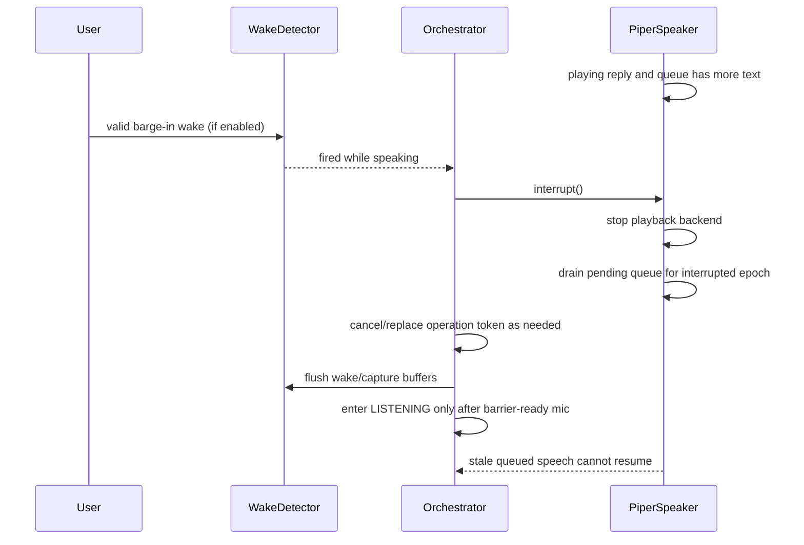

# Technical Design: Jarvis Voice Turn-Taking Improvement

## Summary

Implement the change as a small convergence over the current local batch voice architecture, not as a streaming/AEC redesign. Current code already contains several post-research fixes, but the design standardizes them behind explicit turn epochs, operation tokens, prompt-completion evidence, and one reusable readiness barrier before all capture paths.

Non-goals from the proposal are preserved: no AEC, no hardware/provider/persistence redesign, no streaming protocol replacement, no safety-gate weakening, no destructive/dictation/history-shape changes except exact lifecycle invalidation.

## Current-code reconciliation

Research is stale in several important ways:

| Area | Research snapshot | Current code | Design implication |
| --- | --- | --- | --- |
| Initial silence | `gather_utterance()` could count initial silence as trailing silence. | `audio/capture.py:gather_utterance_result()` now has `speech_started`, bounded idle pre-roll, ordinary no-onset-deadline mode, confirmation deadline cancellation, and `NO_FRAME` vs silence. Legacy `gather_utterance()` also only applies trailing silence after speech starts. | Keep this behavior, make it the required seam, and avoid adding a second competing capture algorithm. |
| TTS queue interruption | `PiperSpeaker.interrupt()` stopped playback only. | `audio/pipeline.py:PiperSpeaker.interrupt()` now stops playback and drains pending queue entries. | Retain queue drain; make stale-epoch cancellation explicit for future streaming producers. |
| Confirmation prompt | `confirm()` previously spoke then captured immediately. | `orchestrator/confirm.py:confirm()` now uses `speak_and_wait()`/prompt completion before starting the 15s authorization window. | Still needs the full readiness barrier ordering before confirmation capture: cooldown, wake flush, capture flush, mic ready. |
| Follow-up timing | Deadline could be set at execution/TTS enqueue. | `orchestrator/loop.py` has `conversation_after_playback` and sets `conversation_until` when IDLE observes playback finished. It also has an active epoch that can keep ordinary capture open beyond a fixed window. | Use playback completion as the only anchor; clarify relationship between legacy `conversation_until` and active conversation. |
| Lifecycle goodbye | Not present or incomplete in research. | `interpreter.is_goodbye()`, dictation goodbye precedence, `_close_goodbye()`, and epoch/token cancellation exist. | Harden as volatile-epoch contract and ensure off wins over goodbye/output. |
| Off/output cancellation | Research emphasized safety boundaries. | `_apply_switch(..., speaker)` calls `speaker.close()` on off; `close()` flushes queued speech before closing, so off may wait for output instead of cancelling it. | Replace off path with interrupt/cancel semantics; do not flush stale output on off. |
| Barrier | Research proposed a helper. | `_prepare_ordinary_capture()` flushes wake/capturer and starts mic for ordinary active capture, while other paths duplicate sequencing. | Promote this into one barrier used by ordinary, follow-up, reask, and confirmation capture. |

## Architecture decisions

### AD-1: Keep local batch turns; do not adopt Xiaozhi streaming

Jarvis remains `wake → finite capture WAV → Whisper STT → interpreter → executor → async TTS`. Xiaozhi/AI Chat Bot validates stateful turn-taking concepts, but its Opus/WebSocket/AEC protocol is out of scope.

Rationale: the proposal excludes streaming protocol replacement and AEC. The local bugs are ordering, stale buffers, and stale work, not protocol negotiation.

### AD-2: The orchestrator owns volatile conversation identity

`orchestrator/loop.py:_Context` remains the owner of:

- `epoch_serial`: monotonically increasing serial.
- `active_epoch`: current active conversation or `None` for wake standby/off.
- `operation`: current `OperationToken` for cancellable work inside the epoch.
- `authorization`: pending destructive authorization tied to the current operation token.

Fresh wake, GUI off, restart, goodbye, and epoch replacement cancel the previous operation and invalidate pending authorization before new work can execute or speak.

Rationale: local Jarvis has no server-side listen/tts authority, so stale work must be rejected locally at every async boundary.

### AD-3: Readiness is evidence, not sleep

Create one readiness barrier that verifies, in order:

1. The relevant prompt/output has completed with explicit completion evidence when a prompt was requested.
2. No queued or active TTS remains via `speaker.is_playing()`.
3. Post-playback cooldown has elapsed from actual playback end.
4. Wake detector buffers have been flushed.
5. Capturer buffers have been flushed.
6. Mic/capturer has been started and no cancellation/off occurred.

Fixed sleeps may be used inside cooldown/beep settling, but they are not sufficient by themselves.

Rationale: the specs require completion evidence and buffer/mic readiness before capture. This also prevents confirmation prompts and reask prompts from being transcribed as user input.

### AD-4: Confirmation authorization starts only after prompt completion and barrier success

The 15s destructive confirmation window starts after verified prompt completion and the readiness barrier returns ready for confirmation capture. At `T + 15s` exactly, authorization is expired.

Rationale: `system-control` requires finite, non-renewable authorization that is independent of ordinary indefinite onset waiting.

### AD-5: Goodbye is exact deterministic lifecycle control

`interpreter/interpreter.py:is_goodbye()` remains pure and exact over `normalize_boundary()`. It must only accept `terminamos` and `hasta luego` as standalone utterances. Dictation calls this before ordinary dictated content, but quoted/embedded/negated mentions remain content.

Rationale: lifecycle closure must not depend on an LLM and must fail closed.

### AD-6: Off beats every voice lifecycle state

GUI off invalidates operation and authorization, stops capture, interrupts active/queued output, and enters `State.OFF` without goodbye acknowledgement. On/restart/conversation close returns to wake standby and requires fresh wake.

Rationale: `assistant-lifecycle` gives off stronger precedence than goodbye, dictation, confirmation, output, and pending turn work.

## Sequence and event diagrams

### Happy path: wake → capture → STT → interpret → action → TTS → follow-up

```mermaid
sequenceDiagram
    participant U as User
    participant W as WakeDetector
    participant O as Orchestrator
    participant B as ReadinessBarrier
    participant C as UtteranceCapture
    participant S as WhisperSTT
    participant I as Interpreter
    participant A as Executor
    participant T as PiperSpeaker

    U->>W: wake/name phrase
    W-->>O: wake verified
    O->>O: activate epoch E, token T1
    O->>B: prepare ordinary capture(E,T1)
    B->>T: verify no queued/active TTS
    B->>W: flush wake buffer
    B->>C: flush capture buffer/start mic
    B-->>O: ready
    O->>C: capture(mode=ordinary, operation=T1)
    C->>C: wait for first speech; retain bounded pre-roll
    C->>C: collect post-onset utterance until endpoint/max
    C->>S: transcribe WAV
    S-->>O: transcript
    O->>I: resolve_intent(transcript)
    I-->>O: intent/control
    O->>A: execute(intent, epoch E, token T1)
    A-->>O: ActionResult(spoken)
    O->>T: speak_with_metrics(spoken)
    O->>O: mark follow-up pending after playback
    T-->>O: playback finished evidence/is_playing false
    O->>B: cooldown + flush + mic ready
    B-->>O: ready for follow-up
    O-->>U: follow-up listening without stale audio
```

### Goodbye race: confirmation/follow-up work vs exact goodbye

```mermaid
sequenceDiagram
    participant U as User
    participant O as Orchestrator
    participant Auth as Authorization
    participant Work as Pending Work
    participant T as Speaker

    O->>Auth: pending destructive authorization(E,T1)
    O->>Work: capture/STT/interpret in epoch E
    U->>O: "hasta luego" exact standalone
    O->>Auth: invalidate(reason=goodbye)
    O->>Work: cancel token T1
    O->>O: active_epoch=None; follow_up=0
    O->>T: speak goodbye acknowledgement
    Work-->>O: late affirmative/result
    O-->>Work: ignored; no execute, no follow-up, no stale speech
```

### Off race: GUI off vs output/capture/goodbye

```mermaid
sequenceDiagram
    participant GUI as GUI/CLI off
    participant O as Orchestrator
    participant C as Capture
    participant T as Speaker
    participant Auth as Authorization

    GUI->>O: switch_off signal/state
    O->>Auth: invalidate(reason=switch_off)
    O->>O: cancel operation token; active_epoch=None
    O->>C: stop/cancel capture
    O->>T: interrupt active playback and drain queue
    O->>O: State.OFF
    T-->>O: late output completion
    C-->>O: late capture/STT result
    O-->>T: no goodbye acknowledgement
    O-->>C: ignore stale result
```

### Barge-in race: wake during speech vs queued TTS



## Concrete seams, files, and symbols

| File | Symbols | Design work |
| --- | --- | --- |
| `jarvis/src/jarvis/audio/capture.py` | `gather_utterance_result`, `CaptureMode`, `CaptureResult`, `SoundDeviceCapturer.flush`, `SilenceVAD`, `SileroVAD` | Keep onset vs endpoint split. Ensure ordinary indefinite onset keeps bounded `pre_roll`; confirmation honors finite deadline and cancellation. |
| `jarvis/src/jarvis/audio/pipeline.py` | `UtteranceCapture.capture`, `PiperSpeaker.speak`, `speak_with_metrics`, `speak_and_wait`, `is_playing`, `interrupt`, `flush` | Use `speak_and_wait` only as prompt-completion evidence. `interrupt` must remain stop+queue-drain. Future producers must also accept epoch/token cancellation. |
| `jarvis/src/jarvis/orchestrator/loop.py` | `_Context`, `_activate_epoch`, `_operation_is_current`, `_close_goodbye`, `_prepare_ordinary_capture`, `_apply_switch`, `_capture`, `State.IDLE`, `State.CONFIRMING`, `State.LISTENING` | Replace `_prepare_ordinary_capture` with or refactor it into a general `ReadinessBarrier` helper used before ordinary, reask, follow-up, and confirmation capture. Change off to interrupt, not `close()`/flush. |
| `jarvis/src/jarvis/orchestrator/confirm.py` | `Authorization`, `confirm`, `_prompt_verified`, `Confirmation`, `CONFIRM_TIMEOUT_S` | Keep immutable authorization lifecycle. Start deadline after prompt completion plus barrier readiness; reject stale token/epoch before validate and consume. |
| `jarvis/src/jarvis/orchestrator/contracts.py` | `OperationToken`, `OperationContext`, `PromptCompletion`, `Speaker` | Treat `OperationToken` as the volatile result filter. Extend protocol only if needed for typed readiness completion, keeping fakes simple. |
| `jarvis/src/jarvis/interpreter/interpreter.py` | `GOODBYE_PHRASES`, `is_goodbye`, `resolve_intent` | Exact standalone goodbye stays deterministic before LLM/general actions. |
| `jarvis/src/jarvis/interpreter/dictation.py` | `DictationManager.is_control_command`, `process_transcript` | Standalone goodbye remains lifecycle control; existing send/clear/exit behavior remains unchanged. |
| `jarvis/src/jarvis/config.py` | `AUDIO_*`, `TTS_COOLDOWN_S` in loop, `CONVERSATION_WINDOW_S`, `BARGE_IN_ENABLED`, `BARGE_IN_WAKE_THRESHOLD` | Keep defaults conservative: barge-in off, no AEC, Silero default, bounded flush/cooldown. Add env knobs only if tests prove hard-coded barrier values need tuning. |

## Volatile epoch/token model

- `active_epoch is None`: standby/off; ordinary utterances require a fresh wake.
- `_activate_epoch()` increments `epoch_serial`, cancels the previous operation, creates a new `OperationToken`, and binds `OperationContext` to cancellable executors.
- Every capture, STT, interpretation, confirmation, execution, and TTS enqueue is associated with the current `(active_epoch, operation)` pair.
- A late result is accepted only if `_operation_is_current()` is true at the decision point.
- Goodbye invalidates authorization, cancels operation, clears follow-up state, and sets `active_epoch=None` before acknowledgement is enqueued.
- GUI off does the same invalidation but suppresses acknowledgement and interrupts output.
- Confirmation authorization is additionally tied to the token and must be live before validation and immediately before execution.

## Readiness barrier ordering

Target helper shape:

```python
@dataclass(frozen=True)
class ReadinessResult:
    ready: bool
    reason: str = ""
    completed_at: float | None = None


def prepare_capture(
    pipeline: Pipeline,
    context: _Context,
    *,
    mode: CaptureMode,
    prompt: str | None = None,
    require_prompt_completion: bool = False,
) -> ReadinessResult: ...
```

Ordering:

1. If off/cancelled/stale epoch, fail closed.
2. If `prompt` is present, call `speaker.speak_and_wait(prompt)` and require completed evidence.
3. Poll/verify `speaker.is_playing()` is false; if it remains true past a bounded internal timeout, fail closed for confirmation and retry/idle for ordinary paths.
4. Set or observe `last_spoke_at` from actual playback completion.
5. Sleep only the remaining cooldown from that timestamp.
6. Flush wake detector via `wake.flush()`.
7. Flush capturer via `wake.capturer.flush(ms=config.AUDIO_FLUSH_MS)`.
8. Start capturer/mic.
9. Re-check off/cancelled/current epoch.
10. Return `ready=True` with `completed_at=clock.now()` for confirmation deadline anchoring.

## Config choices

- Keep `BARGE_IN_ENABLED = False` by default because there is no AEC.
- Keep `BARGE_IN_WAKE_THRESHOLD` higher than normal wake threshold when enabled.
- Keep `AUDIO_USE_SILERO_VAD = True` with energy fallback; do not couple this change to VAD provider redesign.
- Keep `AUDIO_PREROLL_S` bounded for indefinite onset waiting.
- Keep `AUDIO_FLUSH_MS = 1000` and `TTS_COOLDOWN_S = 2.0` unless RED tests or manual instrumentation prove they are excessive.
- Keep `CONVERSATION_WINDOW_S` as a compatibility knob, but active-conversation lifecycle must not depend on a deadline that contradicts the arbitrary-pause requirement.
- Do not add persistence or history schema changes.

## Testing strategy: strict RED → GREEN → TRIANGULATE → REFACTOR

Use `jarvis/.venv/bin/pytest` and keep hardware behind fakes.

### Slice-level TDD loop

1. RED: write a failing unit test for one requirement or race.
2. GREEN: make the smallest production change.
3. TRIANGULATE: add the adjacent boundary case, especially stale token/off/goodbye timing.
4. REFACTOR: extract the common barrier/epoch helper only after at least two call sites prove the shape.

### Required tests

| Area | Tests |
| --- | --- |
| Capture | Initial silence followed by speech succeeds; trailing silence starts only after onset; ordinary onset wait retains bounded pre-roll; confirmation deadline cancels even if onset never happens; `NO_FRAME` is not treated as a completed utterance. |
| Barrier | Ordinary, follow-up, reask, and confirmation capture all call the same readiness seam; capture never starts while `speaker.is_playing()` is true; wake and capturer flush occur before mic start; cancellation/off fails closed. |
| Confirmation | Prompt completion starts the 15s window; exactly `T+15s` expires; late affirmative and stale token cannot execute; retry does not renew authorization. |
| Follow-up | Long TTS preserves the configured follow-up duration after audible playback completion; active conversation remains available after ordinary pauses where required by lifecycle specs. |
| Barge-in | With barge-in enabled, interrupt stops active playback and drains queued TTS; stale queued speech does not resume. With barge-in disabled/name-gated wake, mic remains closed during playback. |
| Lifecycle | Exact `terminamos`/`hasta luego` closes conversation with text+voice ack; embedded/quoted/negated phrases do not close; dictation standalone goodbye wins; GUI off suppresses goodbye ack and leaves off; fresh wake is required after close/restart/off. |
| Safety/history | Destructive golden gate and `power_off_self` confirmation remain required; stale/invalidated work does not create successful history entries; redaction/history shape stays unchanged. |

## Rollback

Each slice must be independently revertible.

- If capture onset changes regress recognition, revert slice 1 capture changes only.
- If the barrier deadlocks or adds unacceptable latency, revert barrier integration while preserving pure tests as skipped/xfail only with explicit reviewer agreement.
- If confirmation changes affect destructive safety, revert the slice immediately; fail-closed behavior is preferred over execution.
- If lifecycle routing conflicts with real commands, revert slice 3 lifecycle routing while keeping lower-level capture/TTS fixes if tests remain green.
- No migration rollback is needed because no persistence schema changes are introduced.

## Three-slice stacked-to-main delivery plan

Canonical review budget is 400 changed lines. Each slice should be stacked on the prior slice and merged to main in order; if a slice risks exceeding 400 lines, pause for a chaining decision rather than requesting a size exception.

### Slice 1 — Capture boundaries and speaker cancellation

Goal: prove low-level audio behavior before orchestrator rewiring.

Scope:

- Keep/adjust `gather_utterance_result()` onset/endpoint behavior.
- Add regression tests for initial silence, no-frame, confirmation deadline, and bounded pre-roll.
- Preserve `PiperSpeaker.interrupt()` stop+queue-drain behavior with tests.

Budget target: under 250 changed lines.

### Slice 2 — Unified readiness barrier and confirmation/reask routing

Goal: ensure no capture path starts before Jarvis is ready.

Scope:

- Extract/refactor `_prepare_ordinary_capture()` into one barrier helper.
- Use it for ordinary active capture, follow-up, reask retry, and confirmation response capture.
- Anchor destructive confirmation deadline after prompt completion plus barrier readiness.
- Add tests for ordering and fail-closed cancellation.

Budget target: 300–400 changed lines. Split if confirmation and reask tests push it over budget.

### Slice 3 — Lifecycle races: goodbye, off, fresh wake, stale work

Goal: complete approved lifecycle semantics and race behavior.

Scope:

- Harden exact goodbye close across ordinary, confirmation, and dictation.
- Make GUI off interrupt output instead of flushing it, invalidate authorization/work, and suppress goodbye ack.
- Enforce fresh wake after close/restart/off.
- Add stale epoch/token tests for late capture/STT/interpret/execution/TTS results and history non-recording.

Budget target: 300–400 changed lines. Keep any unrelated GUI/UI cleanup out of this slice.
